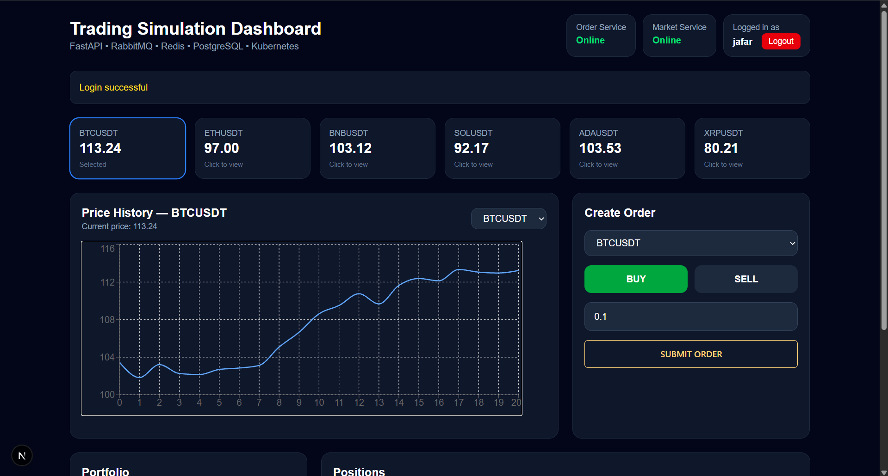
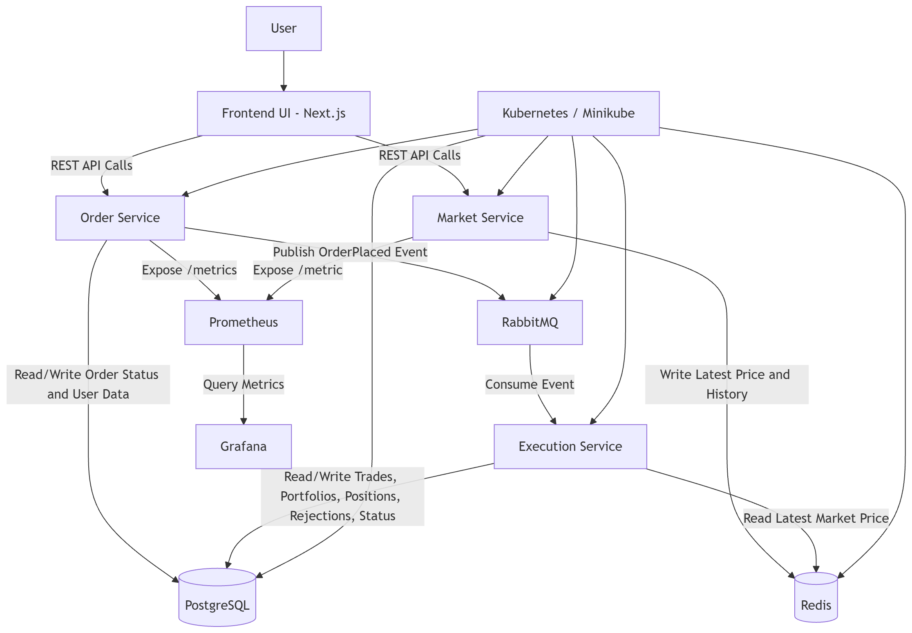
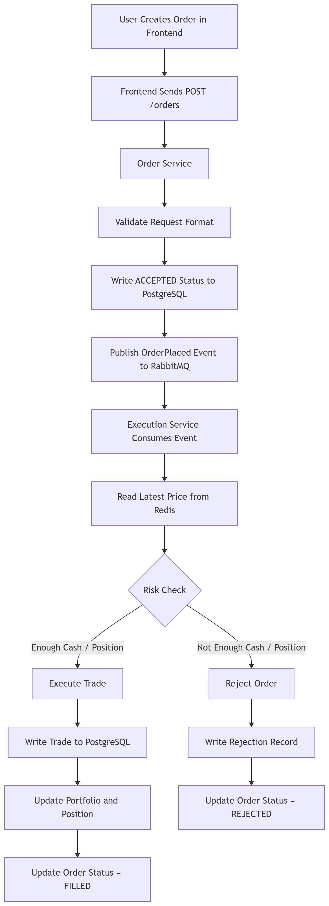
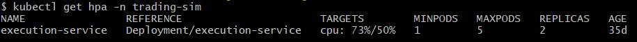
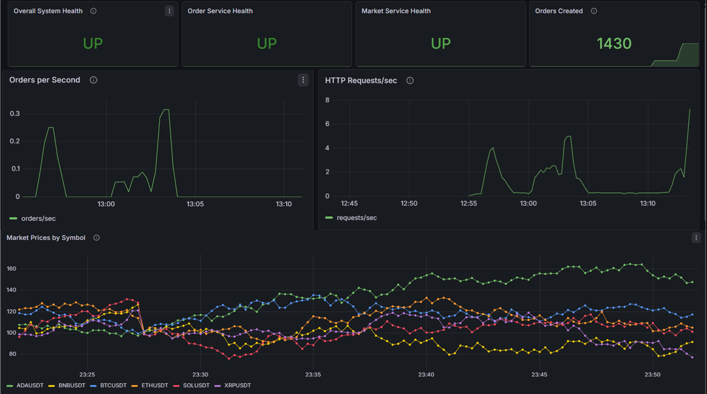
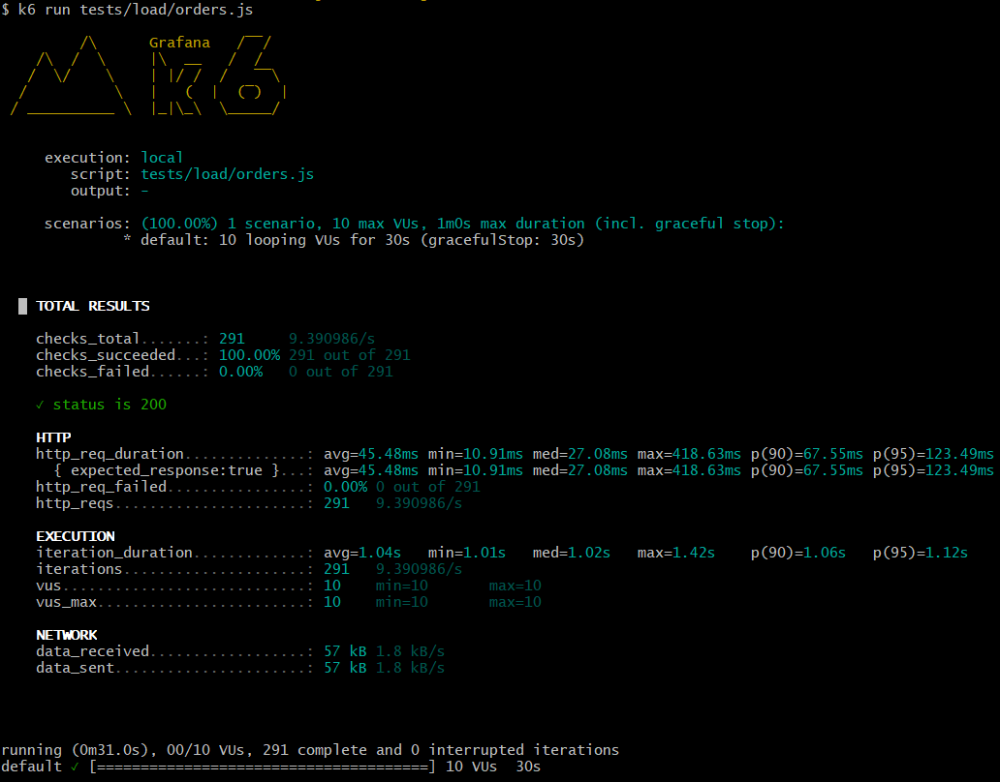

# Trading Simulation Platform

Microservices-based trading simulation platform built as an BSc thesis project. The system demonstrates asynchronous order processing, service separation, persistence, observability, containerization, Kubernetes deployment, autoscaling, and load testing in a controlled trading domain.

🎥 **Project Demo:** https://youtu.be/ZWUR9AhbOVU

This is an educational distributed systems prototype. It does not connect to a real exchange, does not process real money, and does not implement a production financial order book.



## Overview

The application lets a user register, log in, view simulated cryptocurrency prices, submit buy and sell orders, and inspect portfolio state, positions, executed trades, rejected orders, and order status.

The main design idea is that order submission and order execution are separated. The Order Service accepts an order, stores the initial `ACCEPTED` status, and publishes an event to RabbitMQ. The Execution Service consumes the event asynchronously, reads the latest simulated price from Redis, validates the user's cash or position, and persists the final result in PostgreSQL.



## Features

- User registration and login with JWT authentication
- Simulated market prices for `BTCUSDT`, `ETHUSDT`, `BNBUSDT`, `SOLUSDT`, `ADAUSDT`, and `XRPUSDT`
- Buy and sell order creation
- Asynchronous order processing through RabbitMQ
- Portfolio, position, trade, rejection, and order-status persistence in PostgreSQL
- Redis-backed latest price and recent price history storage
- Prometheus metrics for service monitoring
- Grafana dashboards for health, throughput, HTTP traffic, and market prices
- Docker Compose environment for local execution
- Kubernetes manifests for Minikube deployment
- Horizontal Pod Autoscaler example for the Execution Service
- k6 load testing scripts
- Next.js dashboard with Recharts price visualization

## Architecture

The repository is organized around independently deployable units:

```text
.
|-- frontend/                  # Next.js dashboard
|-- infra/
|   |-- docker-compose.yml      # Local multi-container environment
|   |-- k8s/base/               # Kubernetes manifests
|   `-- prometheus/             # Prometheus scrape configuration
|-- services/
|   |-- order/                  # FastAPI API service
|   |-- execution/              # RabbitMQ worker and trade execution service
|   `-- market/                 # FastAPI market data service
|-- tests/load/                 # k6 load tests
`-- images/                     # Thesis figures and screenshots
```

### Service Responsibilities

| Component | Responsibility |
| --- | --- |
| Frontend | User interface for login, prices, orders, portfolio, positions, trades, and rejections |
| Order Service | Authentication, order intake, account read APIs, initial order status, RabbitMQ publishing, metrics |
| Execution Service | RabbitMQ consumption, risk checks, trade creation, portfolio and position updates, final order status |
| Market Data Service | Simulated price generation, Redis price/history writes, market metrics |
| PostgreSQL | Persistent business data: users, orders, trades, portfolios, positions, rejections |
| Redis | Latest simulated prices and short price history |
| RabbitMQ | Durable order queue between Order Service and Execution Service |
| Prometheus | Metrics scraping |
| Grafana | Monitoring dashboard |

## Technology Stack

- Backend: Python 3.11, FastAPI, Pydantic, psycopg, pika, Redis client
- Frontend: Next.js 16, React 19, TypeScript, Tailwind CSS, Recharts
- Infrastructure: Docker, Docker Compose, Kubernetes, Minikube
- Data and messaging: PostgreSQL 16, Redis 7, RabbitMQ 3 Management
- Monitoring and testing: Prometheus, Grafana, k6

## Prerequisites

- Docker Desktop
- Node.js and npm
- Python is not required on the host when using Docker
- Minikube and kubectl for Kubernetes deployment
- k6 for load testing

## Quick Start with Docker Compose

Start the backend services and infrastructure from the repository root:

```bash
docker compose -f infra/docker-compose.yml up --build
```

This starts:

- RabbitMQ: `localhost:5672`, management UI at `localhost:15672`
- PostgreSQL: `localhost:5432`
- Redis: `localhost:6379`
- Order Service: `localhost:8000`
- Market Data Service: `localhost:9000`
- Prometheus: `localhost:9090`
- Grafana: `localhost:3000`
- Execution Service worker

Start the frontend separately:

```bash
cd frontend
npm install
npm run dev
```

Open the dashboard:

```text
http://localhost:3001
```

The frontend uses these API URLs by default:

```text
NEXT_PUBLIC_ORDER_API=http://localhost:8000
NEXT_PUBLIC_MARKET_API=http://localhost:9000
```

## API Endpoints

Order Service: `http://localhost:8000`

| Method | Endpoint | Description |
| --- | --- | --- |
| GET | `/health` | Health check |
| POST | `/auth/register` | Register a user |
| POST | `/auth/login` | Log in and receive a JWT |
| GET | `/users/me` | Return the authenticated user |
| POST | `/orders` | Create a buy or sell order |
| GET | `/orders/{order_id}` | Get order status |
| GET | `/portfolio/{user_id}` | Get cash balance |
| GET | `/positions/{user_id}` | Get symbol positions |
| GET | `/trades/{user_id}` | Get executed trades |
| GET | `/rejections/{user_id}` | Get rejected orders |
| GET | `/metrics` | Prometheus metrics |

Market Data Service: `http://localhost:9000`

| Method | Endpoint | Description |
| --- | --- | --- |
| GET | `/symbols` | List supported trading symbols |
| GET | `/price/{symbol}` | Get latest simulated price |
| GET | `/history/{symbol}` | Get recent price history |
| GET | `/metrics` | Prometheus metrics |

Swagger documentation is available at:

```text
http://localhost:8000/docs
```

## Example Order Request

```json
{
  "user_id": "usr_example",
  "symbol": "BTCUSDT",
  "side": "BUY",
  "qty": 0.1
}
```

Example response:

```json
{
  "order_id": "ord_xxx",
  "status": "ACCEPTED"
}
```

`ACCEPTED` means the order was stored and queued. The final result is produced asynchronously by the Execution Service and can later become `FILLED` or `REJECTED`.



## Kubernetes Deployment

Start Minikube:

```bash
minikube start
```

Use the Minikube Docker environment:

```bash
eval $(minikube -p minikube docker-env)
```

Build service images:

```bash
docker build -t infra-order-service:latest ./services/order
docker build -t infra-execution-service:latest ./services/execution
docker build -t infra-market-service:latest ./services/market
```

Apply Kubernetes manifests:

```bash
kubectl apply -f infra/k8s/base/namespace.yaml
kubectl apply -f infra/k8s/base/redis.yaml
kubectl apply -f infra/k8s/base/postgres.yaml
kubectl apply -f infra/k8s/base/rabbitmq.yaml
kubectl apply -f infra/k8s/base/order.yaml
kubectl apply -f infra/k8s/base/execution.yaml
kubectl apply -f infra/k8s/base/market.yaml
kubectl apply -f infra/k8s/base/prometheus.yaml
kubectl apply -f infra/k8s/base/grafana.yaml
```

Check resources:

```bash
kubectl get pods -n trading-sim
kubectl get svc -n trading-sim
```

Forward services to the host:

```bash
kubectl port-forward svc/order-service 8000:8000 -n trading-sim
kubectl port-forward svc/market-service 9000:9000 -n trading-sim
kubectl port-forward svc/prometheus 9090:9090 -n trading-sim
kubectl port-forward svc/grafana 3000:3000 -n trading-sim
kubectl port-forward svc/rabbitmq 15672:15672 -n trading-sim
```

## Autoscaling

The thesis demonstrates HPA-based scaling for the Execution Service, because the worker can be replicated to consume RabbitMQ messages in parallel.

```bash
kubectl autoscale deployment execution-service --cpu-percent=50 --min=1 --max=5 -n trading-sim
kubectl get hpa -n trading-sim -w
```



## Monitoring

Prometheus:

```text
http://localhost:9090
```

Grafana:

```text
http://localhost:3000
```

RabbitMQ Management UI:

```text
http://localhost:15672
```

Default local RabbitMQ credentials:

```text
guest / guest
```



## Load Testing

Run the normal k6 test:

```bash
k6 run tests/load/orders.js
```

Run the heavier k6 test:

```bash
k6 run tests/load/orders-heavy.js
```

The thesis evaluation observed:

| Scenario | Virtual users | Duration | Requests | Failed requests | Average response time |
| --- | ---: | ---: | ---: | ---: | ---: |
| Normal load | 10 | 30s | 291 | 0% | 45.48 ms |
| Heavy load | 50 | 60s | 1078 | 0% | 2.82 s |



## Thesis Context

This repository accompanies the thesis work on designing, implementing, deploying, and evaluating a scalable distributed application using microservice architecture. The project uses a trading simulation domain to demonstrate:

- service decomposition
- asynchronous processing
- transactional persistence
- queue-based execution
- Redis-backed market data
- observability with Prometheus and Grafana
- Kubernetes deployment and HPA scaling
- load testing with k6

## Limitations

- Simulated prices only; no external market data integration
- No real money, payments, withdrawals, or exchange accounts
- No full order book or matching engine
- Prototype-level authentication and secret handling
- Runtime table creation instead of database migrations
- Local Docker and Minikube setup rather than production cloud infrastructure
- Metrics-based monitoring without distributed tracing

## Future Improvements

- Real market data provider integration
- Limit orders, market orders, partial fills, and matching engine behavior
- Database migrations with Alembic or a similar tool
- Dead-letter queues, retry policies, and stronger idempotency handling
- OpenTelemetry distributed tracing
- WebSocket or Server-Sent Events for live frontend updates
- CI/CD pipeline for tests, image builds, and deployment

## Author

Jafar Hasanli

BSc thesis project, Eotvos Lorand University.
